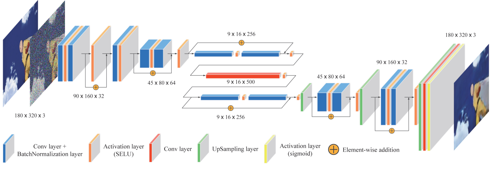
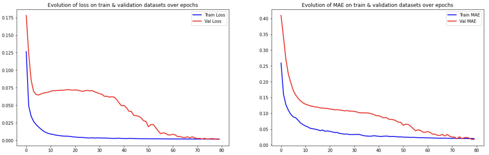
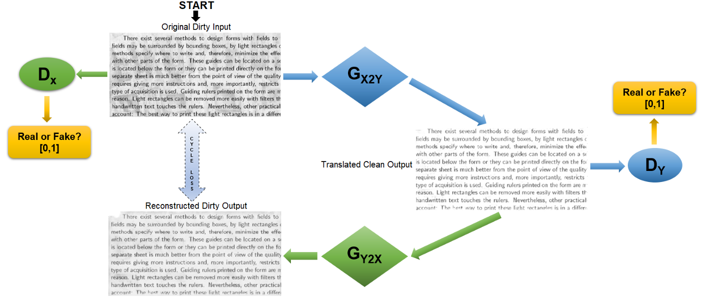
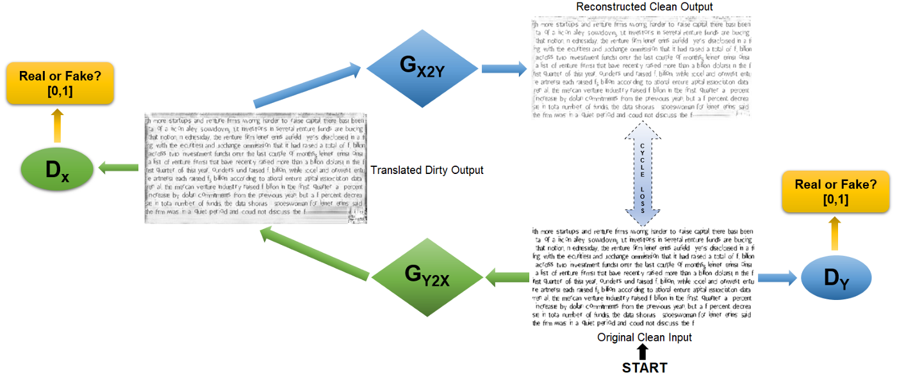

# Preproc-OCR

## Context
Preproc-OCR implementeaza doua metode de deep learning – denoising cu auto-encoders si CycleGAN.

Lucrarea se bazeaza pe:  
- Auto-encoders [[paper]](https://ieeexplore.ieee.org/document/8262546) [[code]](https://www.kaggle.com/competitions/denoising-dirty-documents/code)  
- CycleGAN [[paper]](https://arxiv.org/abs/1703.10593) [[code]](https://www.tensorflow.org/tutorials/generative/cyclegan)

Dataset-ul de antrenament/testare este descarcat de pe [Kaggle – Denoising Dirty Documents](https://www.kaggle.com/competitions/denoising-dirty-documents). 

## Modele

### Auto-encoders
- Prezentare model  
  
- Setari parametri  
  - Epoch: 80  
  - Dimensiune batch: 12  
  - Dimensiune input/output: 540×420  
  - Impartire date pe setul de training: 85% training, 15% validare  
  - Optimizer: Adam  
  - Learning rate: 0.001  
  - Functie de pierdere: mean squared error (MSE)  
  - Metrici: mean absolute error (MAE)
- Error evolution pe epoci  
  

### CycleGAN
- Prezentare model  
  - Conversia input-ului murdar original catre output-ul curat  
      
  - Conversia input-ului curat original catre output-ul murdar  
    
- Setari parametri  
  - Epoch: 80  
  - Dimensiune batch: 6  
  - Dimensiune input/output: 512×512  
  - Impartire date pe setul de antrenament: 100% training  
  - Optimizer: Adam (beta_1=0.5)  
  - Rata invatare: 0.0002  
  - Functie de pierdere: cycle consistency loss
- Proces de antrenament  
  - Forward Mapping  
      
  - Backward Mapping  
    
